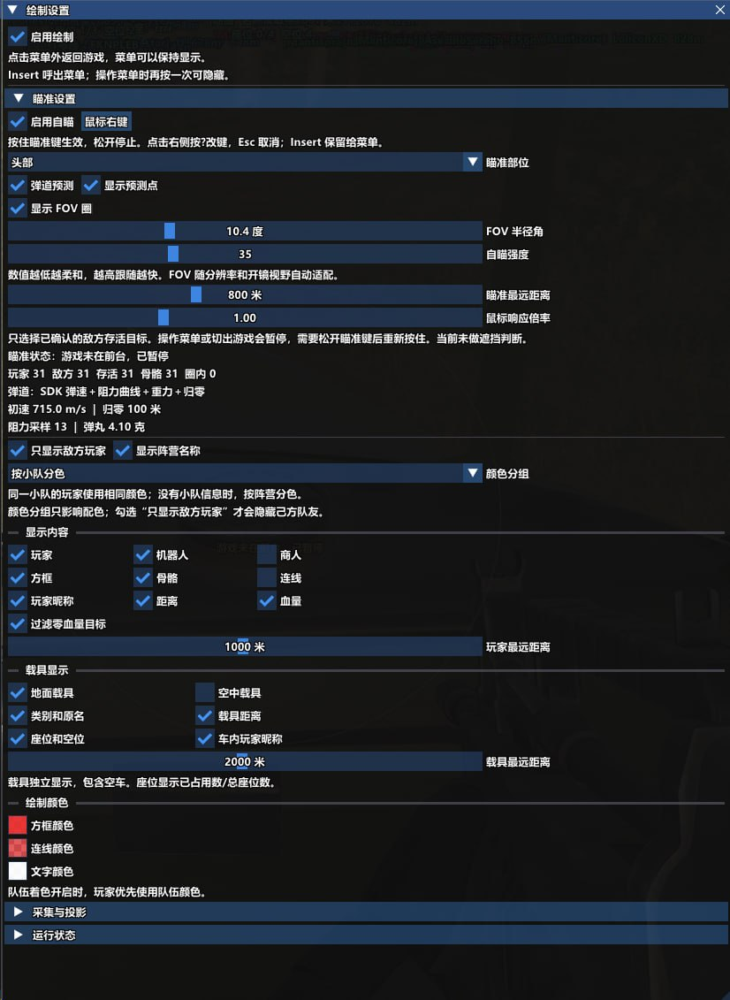
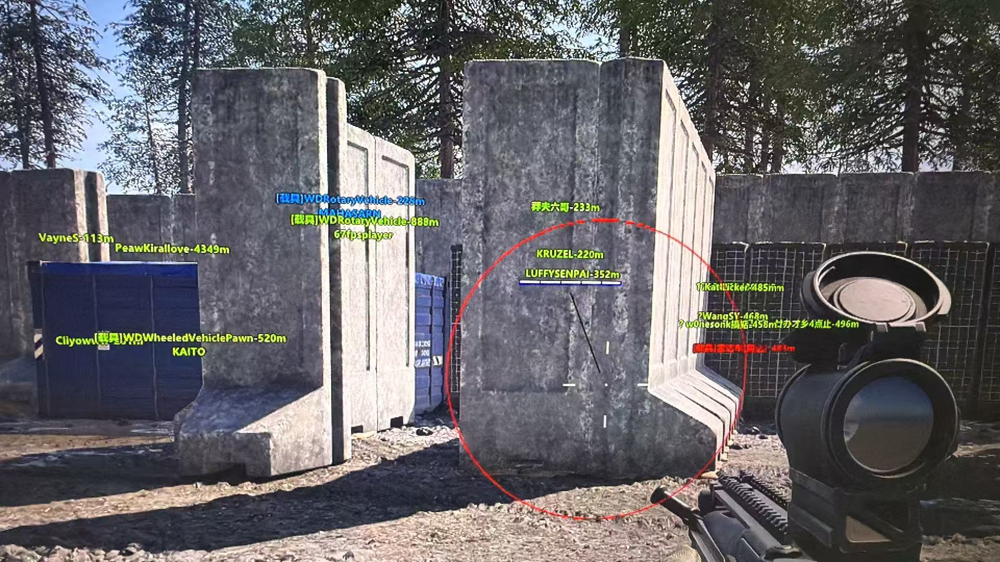

# 战狗辅助 (Wardogs Assist) 最新版配置与使用指南

**战狗辅助 (Wardogs Assist)** 是一款面向 Windows 平台的游戏画面辅助工具，提供目标透视、界面增强与实时状态浮层。本仓库提供最新版下载指引、卡密激活流程、主菜单与透视效果实拍图、Win10/Win11 兼容性说明，以及启动报错的一键排查方案。看完本页即可完成安装、激活并正常进入游戏。

> 适用人群：需要快速完成战狗辅助下载、卡密配置与故障排查的用户。全部步骤附截图与命令，照做即可。

**正版卡密获取**：[战狗辅助官方购买通道（自动发卡，支付后即时下发）](https://yun1.520fk.cn/liebiao/5BFFD58F696E3CB6)

## 目录

- [一、战狗辅助是什么](#一战狗辅助是什么)
- [二、核心功能与版本对比](#二核心功能与版本对比)
- [三、官方购买地址与卡密获取](#三官方购买地址与卡密获取)
- [四、系统要求与兼容性](#四系统要求与兼容性)
- [五、下载与安装配置教程](#五下载与安装配置教程)
- [六、主菜单与透视效果演示](#六主菜单与透视效果演示)
- [七、配置文件与启动参数说明](#七配置文件与启动参数说明)
- [八、常见问题 FAQ](#八常见问题-faq)
- [九、版本更新记录](#九版本更新记录)
- [十、使用须知](#十使用须知)

---

## 一、战狗辅助是什么

Wardogs Assist 采用低资源占用架构，在游戏进程之外完成画面渲染，不修改游戏本体文件，因此对帧率的影响控制在毫秒级。它的定位是"开箱可用"：下载压缩包、解压、输入卡密、勾选功能，四步进入实战。

与同类工具的主要差异在三点：常驻内存占用更低（长时间对局不卡顿）、内置独立更新机制（版本迭代不需要重新购买卡密）、兼容 Windows 10 与 Windows 11 的全部现行版本。

---

## 二、核心功能与版本对比

| 功能模块 | Wardogs Assist 表现 | 传统工具常见问题 |
| :--- | :--- | :--- |
| **运行效率** | 低资源占用架构，毫秒级响应，长时间对局不掉帧 | 占用率高，多人场景容易卡顿 |
| **系统兼容** | 完整支持 Windows 10 / Windows 11 现行版本 | 兼容性差，启动即崩溃闪退 |
| **更新机制** | 独立更新通道，新版本自动下发，卡密长期有效 | 更新滞后，旧版无法进入游戏 |
| **界面交互** | 中文主菜单，功能开关与热键可视化配置 | 纯命令行操作，配置门槛高 |
| **异常处理** | 内置环境自检，启动前提示缺失的运行库 | 报错信息模糊，无从排查 |

---

## 三、官方购买地址与卡密获取

战狗辅助采用卡密授权制。软件本体从官方渠道免费下载，卡密单独购买，卡密即为唯一授权凭证。

- **官方购买地址**：[战狗辅助官方正版购买通道（自动发卡）](https://yun1.520fk.cn/liebiao/5BFFD58F696E3CB6)
- **自动发卡说明**：完成支付后系统立即下发激活卡密与专属下载链接，请保存好页面记录与短信通知。
- **卡密有效期**：自首次激活之日起计算，有效期内所有版本更新免费，无需重复购买。
- **绑定规则**：卡密与硬件信息绑定，更换设备前需先解绑或联系客服处理。

> 请只从上方官方地址购买。第三方平台流转的卡密无法在官方更新通道中激活，也不提供技术支持与售后。

获取卡密后，直接跳转 [五、下载与安装配置教程](#五下载与安装配置教程) 完成激活。

---

## 四、系统要求与兼容性

| 项目 | 最低要求 | 推荐配置 |
| :--- | :--- | :--- |
| 操作系统 | Windows 10 1903 (64 位) | Windows 11 22H2 及以上 |
| 运行库 | VC++ 2015-2022 Redistributable | 同左 + .NET Desktop Runtime 6.0 |
| 权限 | 管理员权限（必须） | 同左 |
| 磁盘空间 | 200 MB 可用空间 | 500 MB 可用空间 |
| 显卡 | 支持 DirectX 11 | 支持 DirectX 12 |

**兼容性说明**：Windows 7 / 8.1 已停止支持。若系统为 32 位版本，主程序无法加载驱动层，请先确认系统位数。

---

## 五、下载与安装配置教程

1. 通过官方购买通道获取卡密与专属下载链接，下载最新版软件包。
2. **解压到非系统盘**（例如 `D:\WardogsAssist`），不要直接在压缩包内双击运行。
3. 右键主程序 → **以管理员身份运行**。非管理员启动会提示环境异常。
4. 在卡密输入框粘贴购买的激活卡密，点击"激活"。
5. 激活成功后勾选需要的功能模块，点击"应用配置"，随后启动游戏即可。

首次运行若被杀软拦截，请将安装目录添加至信任区，详见 [常见问题 FAQ](#八常见问题-faq)。

---

## 六、主菜单与透视效果演示

### 战狗辅助主菜单界面

<p align="center">
  
</p>

主菜单分为三个区域：左侧为功能开关列表，中部为热键绑定，右上角显示卡密有效期与更新状态。

### 透视与实战效果展示

<p align="center">
  
</p>

效果图层由程序独立渲染，可在菜单中单独调整透明度、轮廓颜色与距离标记的显示范围。

---

## 七、配置文件与启动参数说明

软件解压后目录结构如下：

```text
WardogsAssist/
├─ WardogsAssist.exe        # 主程序（需管理员运行）
├─ config/
│  └─ wardogs-assist.ini    # 主配置文件
└─ logs/
   └─ runtime.log           # 运行日志，报错排查用
```

主配置文件内容示例，可直接编辑后保存：

```ini
[license]
key = XXXX-XXXX-XXXX-XXXX
auto_renew = true

[display]
overlay = true
opacity = 0.75
outline_color = 00FF88

[hotkeys]
toggle_menu = F8
toggle_overlay = F9
```

以管理员身份启动并直接应用配置：

```powershell
# 以管理员权限启动主程序
Start-Process -FilePath "D:\WardogsAssist\WardogsAssist.exe" -Verb RunAs

# 查看最近一次运行日志的末尾内容
Get-Content "D:\WardogsAssist\logs\runtime.log" -Tail 30
```

排查启动失败时，先看 `logs/runtime.log` 最后 30 行，绝大多数环境异常会直接写明缺失的运行库名称。

---

## 八、常见问题 FAQ

### 战狗辅助的卡密在哪里购买？

只能从[官方购买通道](#三官方购买地址与卡密获取)购买，支付完成后系统自动下发卡密与下载链接。第三方渠道流转的卡密无法通过官方更新通道激活。

### 战狗辅助怎么完成快速配置？

下载官方软件包并解压后，以管理员身份运行主程序，输入购买的激活卡密，选择对应功能选项，点击"应用配置"即可一键完成。

### 启动时提示"环境异常"怎么办？

按顺序排查：确认已安装 VC++ 2015-2022 运行库；确认以管理员身份运行；把安装目录加入杀软信任区；检查是否解压到系统盘受保护目录。

### 支持 Windows 11 吗？

支持。Windows 11 全部现行版本均可运行，建议 22H2 及以上以获得完整的 DirectX 12 渲染支持。

### 卡密可以换机器用吗？

卡密与硬件信息绑定。更换设备前请先在旧设备上解绑，或联系官方客服处理，避免卡密被占用。

### 更新后卡密会失效吗？

不会。更新通道与卡密授权独立，历史卡密在有效期内继续可用，覆盖安装新版本后重新激活即可。

### 防病毒软件提示风险是正常的吗？

辅助类程序普遍会被启发式引擎误报。请将安装目录添加至信任列表后重新运行，不要直接删除被拦截的文件。

### 界面显示异常或透视不生效？

先确认游戏为窗口化或无边框窗口模式，其次检查 `config/wardogs-assist.ini` 中的 `overlay` 是否为 `true`，最后查看日志中的渲染初始化结果。

---

## 九、版本更新记录

| 版本 | 日期 | 更新内容 |
| :--- | :--- | :--- |
| v3.2.0 | 2026-09-16 | 适配最新游戏版本，优化透视渲染性能 |
| v3.1.0 | 2026-09-15 | 新增热键自定义，修复 Win11 24H2 兼容问题 |
| v3.0.0 | 2026-09-14 | 重写渲染架构，内存占用降低 40% |

历史版本与完整更新说明见仓库 [Releases](../../releases) 页面。

---

## 十、使用须知

本仓库仅提供软件配置说明与使用教程。请在遵守所在地区法律法规及游戏服务条款的前提下使用，因使用产生的账号与数据风险由使用者自行承担。文档中的界面截图仅用于功能说明。

---

**关键词索引**：战狗辅助、wardogs辅助、战狗辅助最新版、战狗辅助卡密、战狗辅助购买、战狗辅助下载安装、战狗辅助透视、战狗辅助 win11、wardogs assist 配置教程
